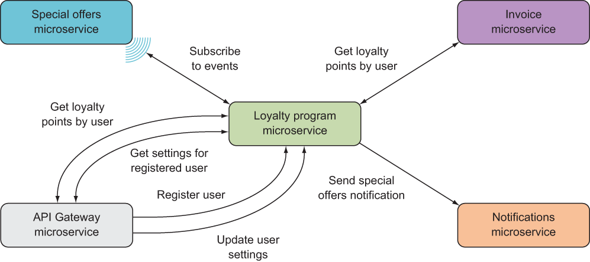
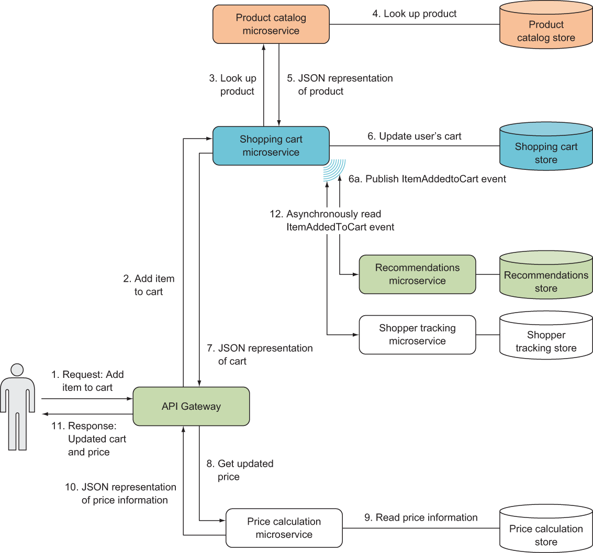
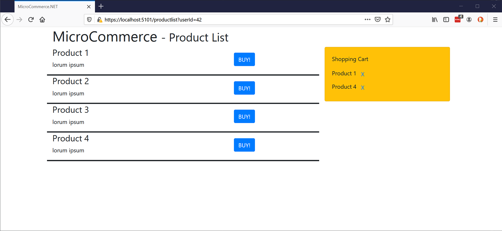

# Microservices in .NET

Annotated projects from Christian Horsdal's [_Microservices in .NET, Second Edition_](https://www.manning.com/books/microservices-in-net-second-edition). This repository contains the final versions of the programs found in the [original repository](https://github.com/horsdal/microservices-in-dotnet-book-second-edition), but with some bug fixes, annotations, supplementary Makefiles, and example requests. I am using the conventional MVC directory structure rather than following the structure used in the book. For more discussion on the book and my thoughts about it, see its associated [blog post](https://ejacobg.com/projects/microservices-in-dotnet/).

## Directory Guide

### `Hello/`

This is an example microservice that exposes a single endpoint at `/`. A string containing the current datetime is returned for all GET requests.

### `LoyaltyProgram/`

The Loyalty Program application covers chapters 5 (Microservice Communication/Collaboration), 7 (Robustness & Error Handling), 8 (System/E2E Tests & Unit Tests), 10 (Authentication), and 11 (Using Custom NuGet Packages). Note that the code from chapter 10 was disabled since it assumes the use of something like Azure API Management, and the code from chapter 11 was not applied.

There are 5 main components to the loyalty program:



However, only the special offers, loyalty program, and API gateway microservices have been provided. 

The special offers microservice provides basic CRUD endpoints for managing offer objects. Creating, updating, and deleting an offer will raise an event, and and all events can be accessed in order through the event feed.

The loyalty program microservice is fundamentally pretty simple. It allows you to create, read, and update users of the service.

The event consumer service is meant to be an internal component of the loyalty program microservice. It is meant to be run as a cronjob, periodically pulling and processing events from the special offers microservice.

The API gateway service provides a command-line interface into the loyalty program application. It technically isn't needed in order to make requests to the loyalty program microservice however.

#### Usage

The loyalty program application can be run locally, or in a Kubernetes cluster, each with their own caveats.

When running locally, the loyalty program microservice can be run as usual. When running the special offers microservice, take note of the ports its running on and make sure that the event consumer correctly points toward them. Running the event consumer is optional since you can always manually send requests to the special offers service. The API gateway service is also optional (and I haven't tested it either).

When running a Kubernetes cluster, note that as of [`724af0d`](https://github.com/ejacobg/microservices-in-dotnet/commit/724af0dbab4c5662cada188235aba1a7ff4a7bfb), this application assumes that JWT identity tokens have been included for each request, and that your cluster supports network controllers (ie. not Docker Desktop). I have not tried to deploy the application past this commit. Otherwise, Makefile targets have been provided to help deploy the application. You just need to edit the container names. If you're using Azure Kubernetes Service, you can reuse the cluster from the Shopping Cart application to deploy the loyalty program.

### `Microservice.Logging/`

The Logging library configures your application to use Serilog as its logger. In development, a custom logging format has been provided that includes timestamps and request trace IDs. In production, JSON logs are produced. To use this library, simply update your `Program.cs` file as follows:

```c#
public static IHostBuilder CreateHostBuilder(string[] args) =>
    Host.CreateDefaultBuilder(args)
        .UseLogging()
        .ConfigureWebHostDefaults(webBuilder => { webBuilder.UseStartup<Startup>(); });
```

### `Microservice.Monitoring/`

The Monitoring library configures the `/health/startup` and `/health/live` endpoints used by Kubernetes. You can also attach your own health checks to be run when these endpoints are queried. Use library like this:

```c#
public class Startup
{
    public void ConfigureServices(IServiceCollection services)
    {
        services
            .AddHealthChecks()
            .AddAdditionStartupHealthChecks<T>() // Where T implements IHealthCheck. 
            .AddAdditionLivenessHealthChecks<U>();
    }

    public void Configure(IApplicationBuilder app, IWebHostEnvironment env)
    {
        app.UseRouting();
        app.UseKubernetesHealthChecks();
        app.UseEndpoints(endpoints => endpoints.MapControllers());
    }
}
```

### `ShoppingCart/`

The Shopping Cart application covers chapters 2 (Microservice Basics), 3 (Deploying to Kubernetes), 6 (Data Storage), 9 (Monitoring & Logging), and 12 (GUI).

There are 6 main components to the shopping cart:



Like with the loyalty program, not all of these components have been implemented. Only the product catalog, shopping cart, and API gateway have been provided.

The product catalog microservice provides an endpoint that returns product objects from a list of IDs. Unlike what the diagram implies, these objects are generated on-the-fly rather than being pulled from a database. You may find an example response here: https://git.io/JeHiE. Note that this application does not make use of the `attributes` field.

The shopping cart microservice is very similar to the special offers microservice from the Loyalty Program application. It provides endpoints for creating and updating shopping carts (essentially lists of products from the product catalog), and emits events when items are added to and removed from the cart. An endpoint has been provided to query the event log.

The API gateway microservice provides a web interface for working with a shopping cart. You do not have to use the web interface in order to interact with the program; you can always use the provided HTTP requests.

#### Usage

The shopping cart can be run locally or in a Kubernetes cluster. Unlike the loyalty program, you are able to run the shopping cart on Docker Desktop. If you wish to run this application on Azure Kubernetes Service, then you can use the `make aks/create` target to get your cluster set up. You may need to change the names on the `create-aks.sh` script.

The shopping cart microservice has several different implementations for its core interfaces (`IEventStore` and `IShoppingCartStore`), some of which require some extra setup in order to be used. Edit the `Startup.cs` file to switch between implementations.

* When using `EsEventStore`, make sure that you're running an [EventStoreDB](https://www.eventstore.com/eventstoredb) container. Use the Makefile targets to set this up.
* When using `SqlEventStore` or `ShoppingCartStore`, make sure you're running a SQL Server container, and that the `database-setup.sql` script has been run.

The web interface looks like this:



Click the `BUY!` button to add the item to the cart, and click the `X` button to remove that item from your cart. You can change which cart you're adding to/removing from by changing the `userId` query parameter.
